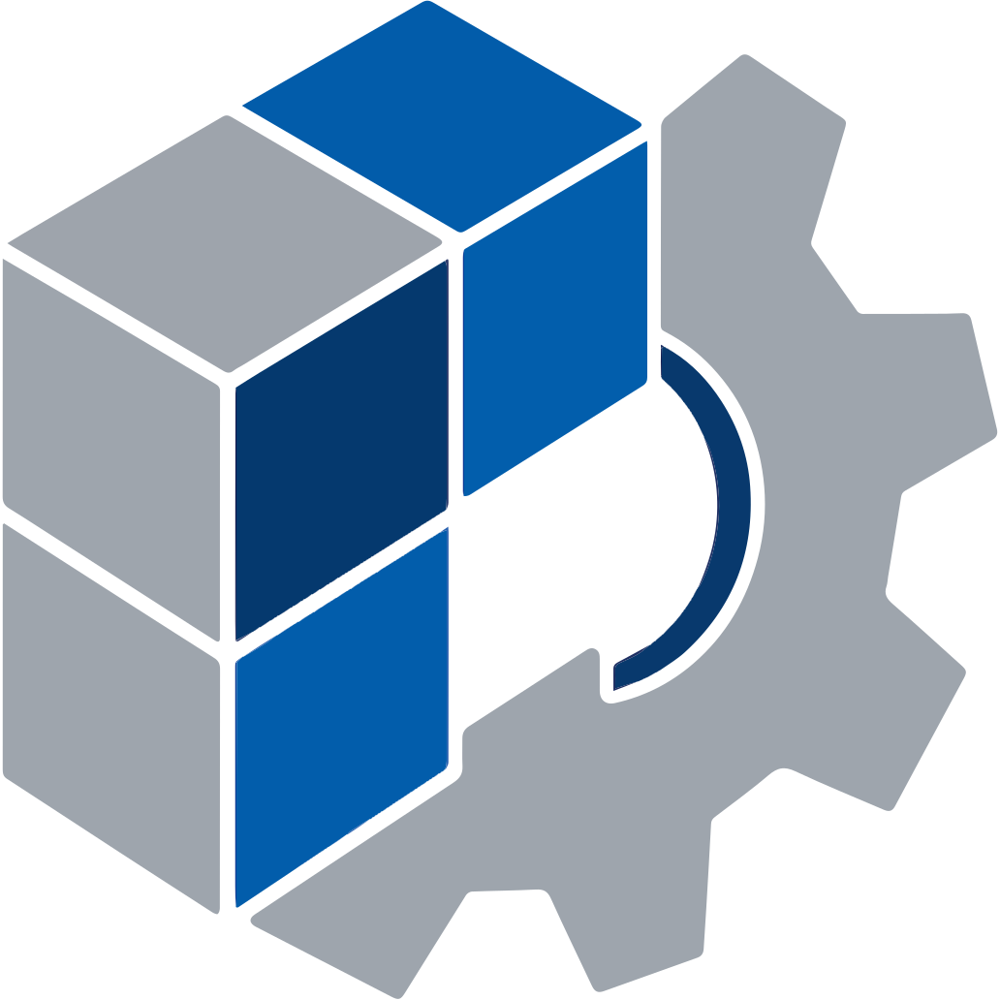
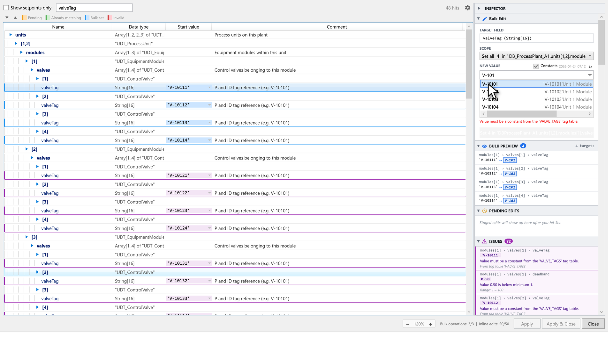
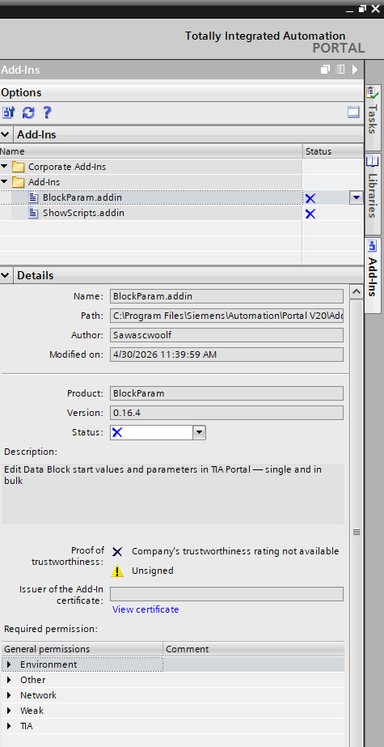
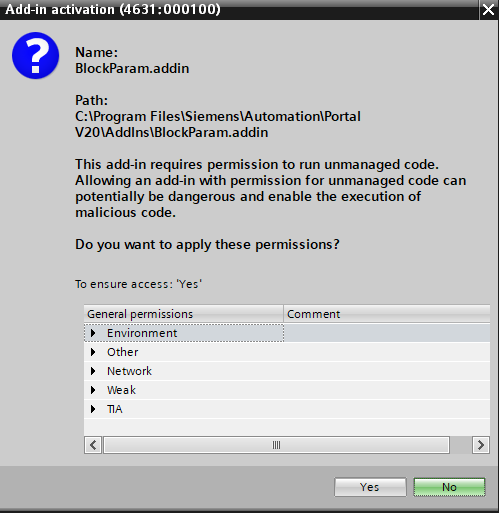
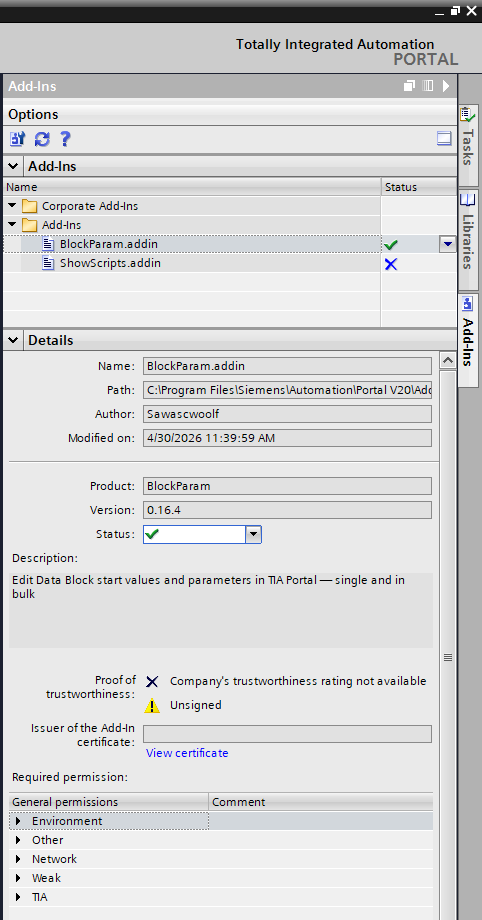
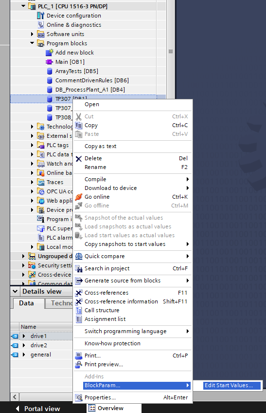

# BlockParam

> A TIA Portal Add-In for editing Data Block start values and parameters &mdash; single and in bulk.

  

  <a href="https://blockparam.lautimweb.de">Website</a> &middot;
  <a href="https://blockparam.lautimweb.de/impressum.html">Impressum</a> &middot;
  <a href="https://github.com/Sawascwoolf/BlockParam/issues">Issues</a> &middot;
  <a href="mailto:support@lautimweb.de">Support</a>

---

Stop clicking through hundreds of UDT instances to change one repeated parameter. BlockParam lets
you right-click a Data Block in TIA Portal, pick a member, and set its value across every matching
instance at once &mdash; with type validation, tag-table autocomplete, automatic comment generation,
and a diff preview before anything is written.

---

## Why BlockParam

Data Blocks in TIA Portal quickly grow into deeply nested UDT structures with the same variable
names repeated across dozens of instances. Keeping those values in sync by hand is tedious,
error-prone, and one of the top time sinks during commissioning. BlockParam turns this into a
single action.

## Features

### Core editing
- **Bulk &amp; single edits** across any hierarchy depth &mdash; the dialog detects your DB's
  structure and offers a scope button per level (parent, grandparent, ..., DB root).
- **Inline editing** with immediate data-type validation for Bool, Int, DInt, Real, String, Time,
  Date, DateTime, and UDT members.
- **Generic analysis** &mdash; works on any DB structure without configuration.

### Validation &amp; rules
- **Rule-based constraints**: data types, numeric `min`/`max`, allowed-value lists, required fields.
- **Regex member-path patterns** with UDT tokens like `{udt:messageConfig_UDT}` to scope rules to
  specific UDT types or paths.
- **Three-level rule hierarchy**: project (`{ProjectPath}\UserFiles\BlockParam\`), local
  (`%APPDATA%\BlockParam\rules\`), and a shared network location. Local overrides win on conflict.
- **Visual rule editor** &mdash; create, edit, and delete rules without touching JSON.

### Tag-table integration
- **Autocomplete dropdown** showing constants, values, and comments from referenced tag tables.
- **Wildcard references** (e.g. `MOD_*`) to pull from every matching table.
- **Required-value enforcement** &mdash; rule can force the value to match an entry from a table.
- **Bulk-edit constants dropdown** when the "Constants" checkbox is enabled.

### Comment automation
- **Template-based comments** with placeholders: `{db}`, `{parent}`, `{self}`, `{memberName}`,
  `{memberName.comment}`, `{memberName.value}`.
- **Bulk-apply** generated comments to every member in scope in one action.
- **Multi-language comments** &mdash; specify a TIA Portal language code per rule.

### Safety
- **Diff preview**: stage changes as "pending" (yellow), review the side-by-side diff, then apply.
- **One-click rollback** if a bulk operation errors out mid-flight &mdash; original DB state is
  restored.
- **Protected-block detection** warns before attempting to edit write- or know-how-protected DBs.
- **Compilation check** prompts to compile inconsistent DBs before export.

### Productivity
- **Live search** with hit count, match highlighting, and smart expansion of matching subtrees.
- **Setpoint filter** hides internal/structural members (configurable per rule).
- **Colour-coded rows**: search hits (yellow), pending edits (orange), already-matching (green),
  affected by bulk op (blue), invalid (red).
- **Unused struct-member cleanup** with safety confirmation (UDT members are never touched).

### Platform
- **English &amp; German UI**.
- **Fast on large DBs** &mdash; bulk operations on ~1500-variable blocks complete in seconds.
- **No-lag context menu** &mdash; right-click is instant.
- **UI zoom** &mdash; `Ctrl+Scroll`, `Ctrl +/-`, `Ctrl+0` (reset). Default 1.2&times; for high-DPI
  readability; persisted per workstation.

## Requirements

- **TIA Portal V20 or V21** (V19 and older are not supported &mdash; the Add-In API targets V20+).
- **.NET Framework 4.8** (bundled with modern Windows).
- **Windows 10/11**.

## Download

Each release ships two `.addin` files &mdash; pick the one that matches your TIA Portal version:

| TIA Portal | File | Direct link |
|---|---|---|
| **V20** | `BlockParam-v<version>-TIA-V20.addin` | [Latest release](https://github.com/Sawascwoolf/BlockParam/releases/latest) |
| **V21** | `BlockParam-v<version>-TIA-V21.addin` | [Latest release](https://github.com/Sawascwoolf/BlockParam/releases/latest) |

All releases: [Releases page](https://github.com/Sawascwoolf/BlockParam/releases).

## Installation

1. Copy the matching `.addin` file (see [Download](#download) above) into:
   - **V20**: `C:\Program Files\Siemens\Automation\Portal V20\AddIns\` (machine-wide, requires admin)
   - **V21**: `%APPDATA%\Siemens\Automation\Portal V21\UserAddIns\` (per-user)

   TIA Portal can stay open &mdash; no restart needed.
2. In TIA Portal, open the **Add-ins** task card (right edge of the window) and enable
   **BlockParam** in the list. TIA shows a security/permission prompt &mdash; confirm it.
   The Add-In stays enabled across sessions; on each version update (new `.addin`
   dropped into the folder) TIA re-prompts for permission once.

   

     
     
     
   

3. Right-click any Data Block in the project tree &rarr; **BlockParam...** &rarr; **Edit Start Values...**

   

     
   

## Pricing

| Tier | Daily limit | Features | Price |
|---|---|---|---|
| **Free** | 3 bulk operations, 50 inline edits | All features included | &euro; 0 |
| **Pro** | Unlimited | All features + priority email support | 15 &euro; / year (net) |

All features work in both tiers &mdash; the Pro tier lifts the daily quota and funds further
development. Pro licenses are sold via [LemonSqueezy](https://blockparam.lemonsqueezy.com) as
merchant of record.

## Documentation

- [`docs/configuration.md`](docs/configuration.md) &mdash; rule-file and config reference
- [`docs/example-config.jsonc`](docs/example-config.jsonc) &mdash; annotated sample config

## Support

- **Bugs &amp; feature requests**: [GitHub Issues](https://github.com/Sawascwoolf/BlockParam/issues)
- **License &amp; billing**: [support@lautimweb.de](mailto:support@lautimweb.de)
- **Subscription management**: [LemonSqueezy customer portal](https://app.lemonsqueezy.com/my-orders)

## Licensing

Source code is published under the [MIT License](LICENSE). The Pro tier (unlimited bulk operations
and inline edits) requires a valid license key &mdash; see [Pricing](#pricing).

## Trademarks

TIA Portal&reg; and SIMATIC&reg; are registered trademarks of Siemens AG. BlockParam is not an
official Siemens product and has no business affiliation with Siemens AG.
