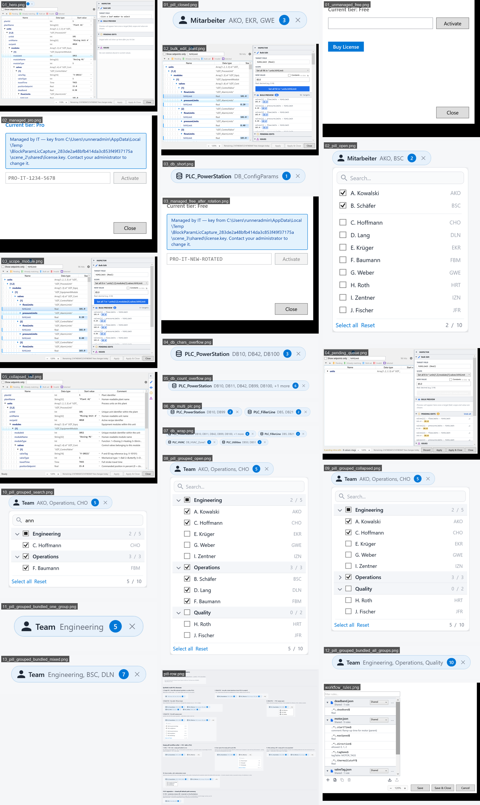

# CI-rendered screenshots

This branch is force-pushed by `.github/workflows/ci.yml` (screenshots job)
on every successful run. **Do not commit by hand — your changes will be
erased on the next run.**

## Single-image overviews

| Layout | Image |
|---|---|
| Desktop (3-col masonry) | [`overview-desktop.png`](overview-desktop.png) |
| Mobile (2-col masonry)  | [`overview-mobile.png`](overview-mobile.png) |



## Individual files

Each PNG below is the headless DevLauncher render of a UI surface.
Reference any file via raw URL:

```
https://github.com/Sawascwoolf/BlockParam/raw/ci-screenshots/<name>.png
```

## This refresh

- Source branch: `claude/fix-issue-141-0O8VT`
- Source commit: `da3e572`
- Run: https://github.com/Sawascwoolf/BlockParam/actions/runs/26059999050
- Timestamp (UTC): 2026-05-18T20:58:09.1459912Z
