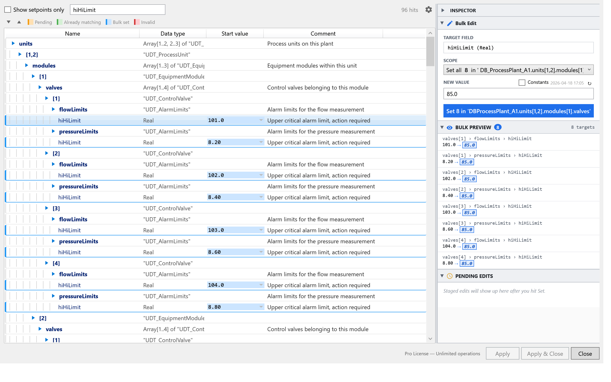
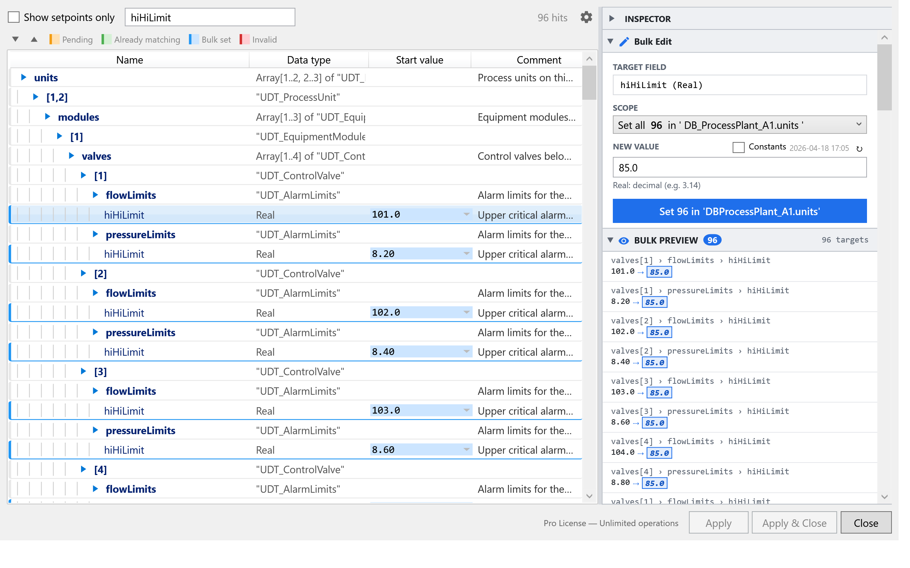
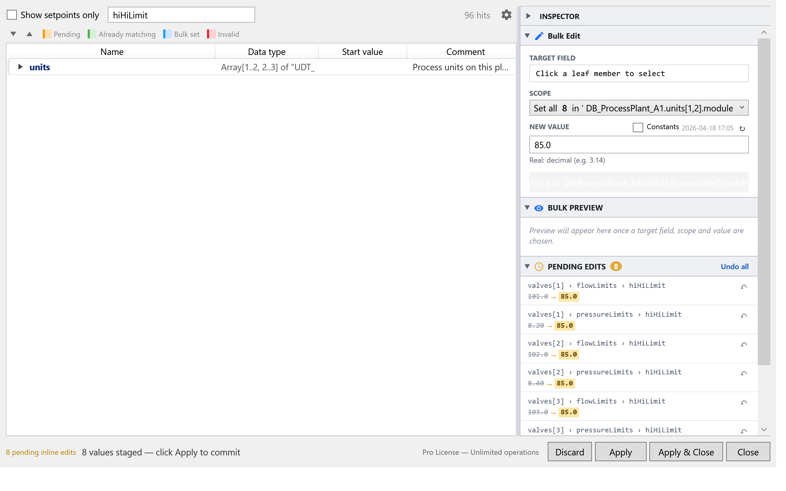
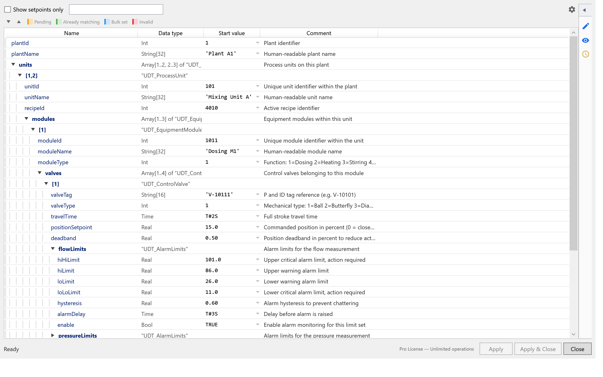

# Bulk Apply Workflow

The core BlockParam workflow: pick a member, pick a scope, set a value, preview, apply.
This page walks through it end-to-end.

## The big picture

You're editing start values **inside one Data Block**. The DB usually contains
many UDT instances with the same nested member names. BlockParam lets you change
one of those member names across many instances in a single action.

The workflow has four steps:

1. **Find** the member you want to change (search or scroll).
2. **Select** the scope (which sibling instances to include).
3. **Stage** the new value as a "pending edit".
4. **Apply** all pending edits in one operation.

Until you press **Apply** or **Apply & Close**, nothing is written to the DB.

## 1. Find the member

Type into the search box at the top of the tree. The tree filters live and shows
the hit count to the right of the box. Matching subtrees auto-expand and the
matched text is highlighted.

  <video src="../../assets/screenshots/search/search_filter.mp4" controls width="600"></video>

> Search runs locally on the in-memory tree — it's fast even on DBs with thousands of members.

You can also navigate by expanding the tree manually if you prefer.

## 2. Select the scope

Click the cell in the **Start value** column for the member you want to change.
The row highlights and the **Bulk Edit** panel on the right populates with the
selection.

The **Scope** dropdown shows one option per ancestor level. The dialog detects
your DB's actual hierarchy and offers a "Set all N in `<path>`" entry for each
level — from the immediate parent up to the DB root.

  

In the screenshot above the scope is **module-level** (`...units[1,2].modules[1]`),
which selects the 8 matching `hiHiLimit` cells inside that one module. The selected
targets are highlighted **blue** (Bulk set) in the tree.

Widening the scope to the plant level catches the same member across every unit
and module — 96 targets:

  

## 3. Stage the new value

Type the new value in the **NEW VALUE** field. The dialog validates against the
member's data type immediately — invalid values are rejected before they're staged.

If the member has a [tag-table rule](tag-tables.md), an autocomplete dropdown
appears as you type, and you can also tick the **Constants** checkbox to pick
from a dropdown of allowed constants.

Press **Set N in `<path>`** to stage the change. The targets move from blue (Bulk set)
to **orange** (Pending). The pending entries appear in the **PENDING EDITS**
panel on the right.

  

You can repeat steps 1-3 to stage edits to multiple different members before applying.

## Color legend

| Color | Meaning |
|---|---|
| Yellow | Search hit |
| Orange | Pending edit (staged but not yet written) |
| Green | Already matches the new value (no change needed) |
| Blue | Selected as a bulk-edit target (current scope) |
| Red | Invalid value or constraint violation |

The legend also appears at the top of the tree in the dialog itself.

## 4. Apply

Use one of the buttons at the bottom right:

- **Apply** — write all pending edits to the DB and keep the dialog open.
- **Apply & Close** — write all pending edits and close the dialog.
- **Discard** — clear all pending edits without writing anything.
- **Close** — close the dialog. If pending edits are present you're warned first.

The status bar shows a summary like "8 pending inline edits — click Apply to commit".

### What happens during apply

BlockParam picks one of two paths depending on scope size:

- **Small scopes** (≤ a few members) use the TIA Openness `SetAttribute` API directly,
  which **preserves the TIA Portal undo stack**. You can Ctrl+Z normally afterwards.
- **Large scopes** use **XML export → modify → import** under
  `ExclusiveAccess`. This is much faster on hundreds of changes but
  **disables the TIA undo stack** for that operation. There is no warning before
  this happens — it's an internal optimization.

Either way, the operation is atomic at the BlockParam level: if any change in the
batch fails (e.g. compile-time inconsistency, locked DB), the original DB state
is restored.

## Compile / consistency

If your DB has unresolved UDT references or other inconsistencies, BlockParam
prompts you to compile the project before exporting the XML. You can:

- Compile and retry — recommended.
- Cancel and fix the inconsistency manually.

There's no way to bypass this — the XML round-trip won't work on an inconsistent DB.

## Protected blocks

Write- or know-how-protected DBs are detected up front and a warning appears
before any changes are attempted. You can still try to apply, but TIA will reject
the change and the DB stays untouched.

## Productivity tips

- **`Ctrl + Scroll` / `Ctrl +/-` / `Ctrl + 0`** — UI zoom. Default is 1.2× for
  high-DPI; the setting persists per workstation.
- **Collapse the inspector** to maximize tree width on a narrow display.

  

    
  

- **`Show setpoints only`** (top-left checkbox) hides members that any active rule
  has marked with `excludeFromSetpoints` — typically internal/structural members
  you never want to bulk-edit.

## Next

- [Rule editor](rule-editor.md) — add type validation and constraints.
- [Tag-table integration](tag-tables.md) — autocomplete from external tag tables.
- [Licensing](licensing.md) — daily limits on bulk operations.
