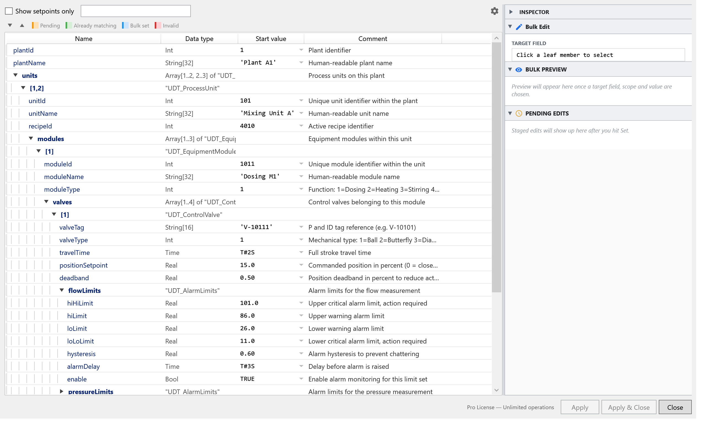

# BlockParam User Guide

End-user documentation for the BlockParam TIA Portal Add-In. If you're new here,
start with [Getting Started](getting-started.md).

  

## Topics

| Page | What's in it |
|---|---|
| [Getting started](getting-started.md) | Install the `.addin`, enable it in TIA Portal, open the dialog. |
| [Bulk apply workflow](bulk-workflow.md) | Pick a member, choose a scope, preview, apply, undo. |
| [Rule editor](rule-editor.md) | Create / edit / delete rules; how the three rule sources merge. |
| [AI prompt for rule authoring](ai-rule-prompt.md) | Copy-paste prompt that turns plain-language requirements into rule JSON. |
| [Comment rules](comment-rules.md) | Comment templates, placeholders, when comments are written. |
| [Tag-table integration](tag-tables.md) | Where tag tables come from, autocomplete, required-value rules. |
| [Config storage](config-storage.md) | Where `config.json` and rule files live; how to back them up. |
| [Licensing](licensing.md) | Free vs Pro tier, daily quotas, what counts as one operation. |
| [Troubleshooting](troubleshooting.md) | Common errors and how to recover. |

## Related docs

- [`docs/configuration.md`](../configuration.md) — JSON schema reference for rule files.
- [`docs/example-config.jsonc`](../example-config.jsonc) — annotated sample config.
- [`docs/admin-license-deployment.md`](../admin-license-deployment.md) — multi-seat license rollout via SCCM / Intune / GPO.

Found a gap or a stale screenshot? Open an issue at
[github.com/Sawascwoolf/BlockParam/issues](https://github.com/Sawascwoolf/BlockParam/issues).
