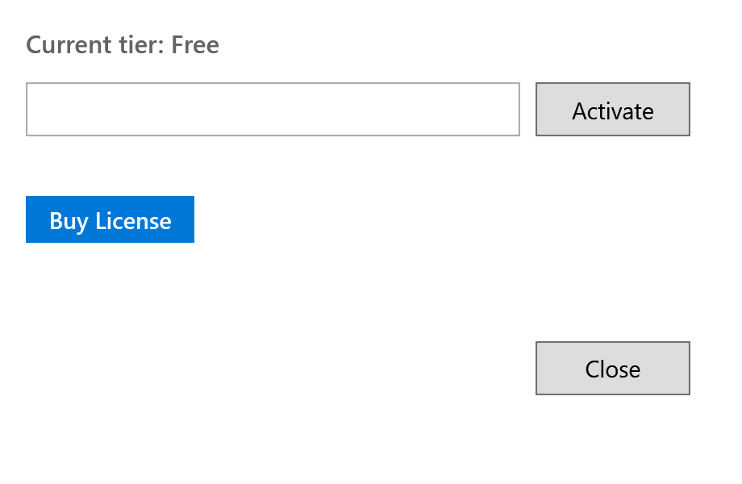
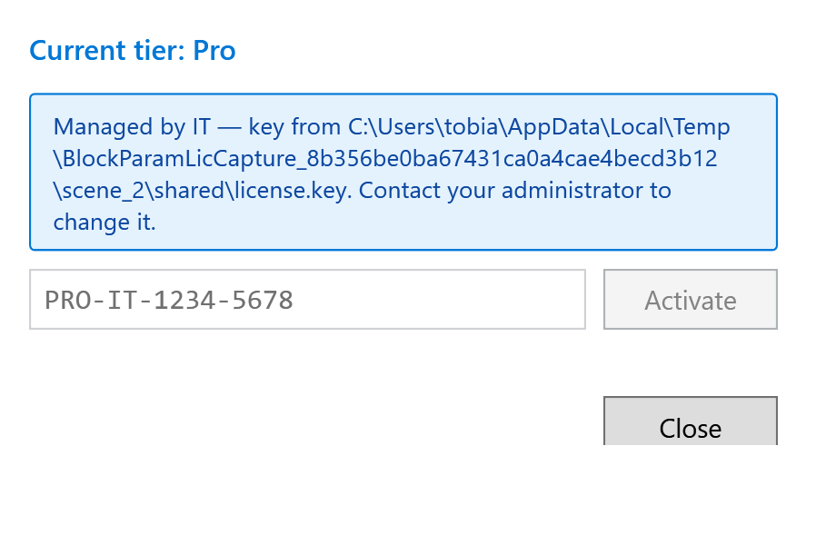

# Licensing

BlockParam is **freemium**. Every feature is in both tiers — the Pro tier lifts
the daily quota and funds further development.

| Tier | Daily limit | Price |
|---|---|---|
| **Free** | 200 value changes per calendar day | € 0 |
| **Pro** | Unlimited | 50 € / year (net) |

The daily counter resets at **local midnight**.

## What counts as one change

One "change" is **one individual start-value write** to the DB. Whether the
change came from a bulk-staged scope or from typing directly into a cell, it
costs the same: one quota unit per value actually written. The counter is
charged on **successful Apply** — staging edits in the dialog is free, and
failed / cancelled Applies don't count.

| Action | Counts as |
|---|---|
| Stage 1 value, click Apply | 1 change |
| Bulk-stage 50 values, click Apply | 50 changes |
| Stage 5, Apply, then stage 5 more, Apply again | 10 changes |
| Discard a pending queue without applying | 0 (nothing was written) |
| Update comments via the comment template | 0 (comments don't draw from the quota) |
| Edit a value, hit Apply, undo via TIA Ctrl+Z | 1 (the undo doesn't refund the quota) |

> Tip: if a single Apply would exceed your remaining quota, the button is
> disabled — drop some edits or upgrade. The dialog won't half-apply.

## Activating Pro

1. Buy a license at [blockparam.lemonsqueezy.com](https://blockparam.lemonsqueezy.com).
   You'll receive a key by email (format: `PRO-XXXX-XXXX-XXXX`).
2. In the Bulk Change dialog, click the **License button** in the bottom bar
   (it shows your current tier, e.g. *"Remaining: 173/200 free changes today"*).
3. Paste the key into the field and click **Activate**.

  
  

The Add-In contacts the license server, validates the key, and enables the Pro
tier. The status bar updates to *"Pro License — Unlimited operations"*.

## How activation works

- The license server tracks **concurrent sessions** per key. The default Pro
  license allows **1 concurrent session** — activating on a second machine while
  the first is still active will fail with a "too many sessions" error.
- The Add-In sends a heartbeat every **2 hours** so the server can release the
  seat when you stop using it.
- If the server is unreachable, the cached validation is good for **48 hours**
  before the Add-In drops back to Free.

If you need more than one concurrent session, contact
[support@lautimweb.de](mailto:support@lautimweb.de) about multi-seat plans.

## Moving Pro to a new machine

1. On the **old** machine: open the License dialog (bottom-bar button) and
   click **Remove License**. This tells the server to release the seat.
2. On the **new** machine: paste the same key into the License dialog and
   click **Activate**.

If the old machine is no longer accessible, the seat is released automatically
after a 48-hour heartbeat-miss window. You can then activate elsewhere.

## Multi-seat / IT-managed deployment

For multi-seat customers, IT can deploy the license key via SCCM, Intune, GPO,
or a batch script — no end-user activation required. See
[`docs/admin-license-deployment.md`](../admin-license-deployment.md) for the
full workflow.

When a license is IT-managed, the License dialog shows a read-only banner:

  

The input box is disabled and the **Remove License** button is hidden so users
can't accidentally clear the IT-pushed key.

## Subscription management

Manage your subscription (cancel, update card, download invoices) at the
[LemonSqueezy customer portal](https://app.lemonsqueezy.com/my-orders).

Lapsed subscriptions: the server stops returning a valid Pro response on the
next heartbeat. You stay Pro for the 48 h cache window, then drop back to Free.

## Privacy

The Add-In sends only the **license key**, an **instance ID**, the **machine
name**, and the **Add-In version** to the license server. No DB content, no
project paths, no telemetry. The server URL is `https://license.lautimweb.de`
unless overridden via `licenseServerUrl` in `config.json`.

## Troubleshooting activation

- **"Server unreachable"** — check internet connectivity and your firewall.
  The Add-In needs HTTPS to `license.lautimweb.de`. Behind a corporate proxy,
  configure system-wide proxy settings; the Add-In honors them.
- **"Too many sessions"** — release the seat on the other machine via
  **Remove License**, or wait 48 h for automatic release.
- **"Invalid key"** — double-check for whitespace; activation strips trailing
  newlines but a missing character is rejected.
- **Pro features stop working out of nowhere** — the 48 h cache expired without
  a successful heartbeat. The status bar will read *"Free License — server
  unreachable"*. Restore connectivity and reopen the dialog.

The full diagnostic log is at `%APPDATA%\BlockParam\blockparam.log` — attach it
to support emails.

## Support

- Billing & licenses: [support@lautimweb.de](mailto:support@lautimweb.de)
- Bugs & feature requests: [GitHub Issues](https://github.com/Sawascwoolf/BlockParam/issues)
- Subscription portal: [LemonSqueezy](https://app.lemonsqueezy.com/my-orders)
