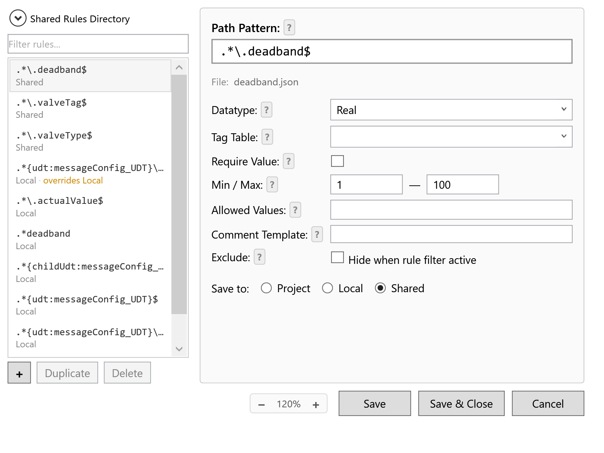

# Rule Editor

Rules describe **which members** should get **which validation** and **which
metadata** (tag tables, comment templates). The Rule Editor is a visual UI for
creating and managing rule files — you don't need to write JSON.

> The Add-In works fully without rules. Rules add value constraints, allowed-value
> lists, tag-table autocomplete, and comment automation. See
> [Bulk apply workflow](bulk-workflow.md) for what works without any rules.

## Open the editor

In the Bulk Change dialog, click the **gear icon** in the top-right of the
toolbar (above the member tree). The Rule Editor opens directly.

  

The left pane lists every rule found across the three rule sources (see
[Rule sources & priority](#rule-sources--priority) below). The right pane shows
the fields for the selected rule.

## Rule fields

| Field | What it does |
|---|---|
| **Path Pattern** | Regex matched against the full member path (e.g. `.*\.deadband$`). Required. UDT tokens like `{udt:messageConfig_UDT}` scope the rule to instances of that UDT type. |
| **Datatype** | Optional TIA data type filter. When set, the rule only matches members of this exact type. Picks from the standard TIA primitives (Bool, Int, DInt, Real, String, Time, …). |
| **Tag Table** | Name of a tag table to pull autocomplete suggestions and constants from. See [Tag-table integration](tag-tables.md). |
| **Require Value** | When ticked, only values that exist in the referenced tag table are accepted. Validation rejects free-form input. |
| **Min / Max** | Numeric bounds for `Real`, `Int`, etc. Validation rejects values outside the range. The Min/Max fields are disabled if the data type doesn't support them (e.g. `Bool`, `String`). |
| **Allowed Values** | Comma-separated list of allowed values. Anything else is rejected. Useful for enum-like ints. |
| **Comment Template** | Auto-generated comment for matched members. See [Comment rules](comment-rules.md). |
| **Exclude** | When ticked, matching members are hidden under the **Show setpoints only** filter. Useful for actual-value or internal members you never want to bulk-edit. |
| **Save to** | Which directory the rule writes to: **Project**, **Local**, or **Shared**. |

Each field has a `?` button that opens a short inline help popup.

## Path patterns

Path patterns are .NET regular expressions matched against the member's full path
inside the DB.

| Goal | Pattern |
|---|---|
| Match every `deadband` member anywhere | `.*\.deadband$` |
| Match `valveTag` only on `UDT_ControlValve` instances | `.*{udt:UDT_ControlValve}\.valveTag$` |
| Match `moduleId` only inside `messageConfig_UDT` instances | `.*{udt:messageConfig_UDT}\.moduleId$` |
| Match a specific path | `^units\[1,2\]\.modules\[1\]\.valves\[\d+\]\.valveTag$` |

The `{udt:TypeName}` token expands at match time to "any path segment whose type
is `TypeName`". This lets you scope a rule to instances of a UDT regardless of
where they appear in the DB.

The `Save to` choice controls which file the editor writes; the filename is
auto-derived from the path pattern (you can override it manually).

## Rule sources & priority

Rules are loaded from up to three directories. Higher-priority rules override
same-named rules in lower-priority directories:

| Priority | Source | Default location |
|---|---|---|
| 1 (highest) | **Project** | `{TIAProjectPath}\UserFiles\BlockParam\` |
| 2 | **Local** | `%APPDATA%\BlockParam\rules\` |
| 3 (lowest) | **Shared** | configured per-installation in the editor's **Shared Rules Directory** field |

The list pane in the editor shows the source under each rule name. When the same
filename exists in multiple sources, only the highest-priority version is shown
and an `overrides Local` (or `Shared`) badge appears.

**Use cases:**

- **Project** — rules that ship with the TIA project file. Commit them to source control
  alongside the project. Every engineer who opens the project gets them automatically.
- **Local** — your personal rules; not shared with anyone.
- **Shared** — a network folder the whole team points at. New engineers point at
  the shared dir once and get the team's standard rule set.

## Buttons

| Button | What it does |
|---|---|
| **+** | Create a new rule. Default destination is Project if available, otherwise Local. |
| **Duplicate** | Copy the selected rule. Useful to base a new rule on an existing one. |
| **Delete** | Delete the rule file from disk. Cannot be undone. |
| **Reset to base** | Visible only on overrides — deletes the override and reveals the next-priority version. |
| **Save** | Save all dirty rules; keep the editor open. |
| **Save & Close** | Save and close. |
| **Cancel** | Discard unsaved changes and close. |

The bottom toolbar has a **zoom slider** that scales the entire editor
(useful on high-DPI displays).

## Validation

Rules are validated on save:

- **Path Pattern** must be present.
- **Min ≤ Max** is enforced when both are set and the data type is numeric.
- **Min / Max** values must be parseable as the selected data type (e.g. `T#5s`
  for `Time`, `16#FF` for hex).

If validation fails, the dirty rule that caused the failure is selected and the
error is shown in the validation banner. Nothing is written until you fix it.

## Where rules end up on disk

Rules saved as **Local** end up in `%APPDATA%\BlockParam\rules\<filename>.json`
as one rule per file. The on-disk format is documented in
[`docs/configuration.md`](../configuration.md), and you can hand-edit the JSON
if needed (the editor will pick up your edits the next time it opens).

See [Config storage](config-storage.md) for the full list of paths and how to
back them up.

## Next

- [Comment rules](comment-rules.md) — comment templates with placeholders.
- [Tag-table integration](tag-tables.md) — wiring rules to tag tables.
- [Config storage](config-storage.md) — paths, backup, version control.
