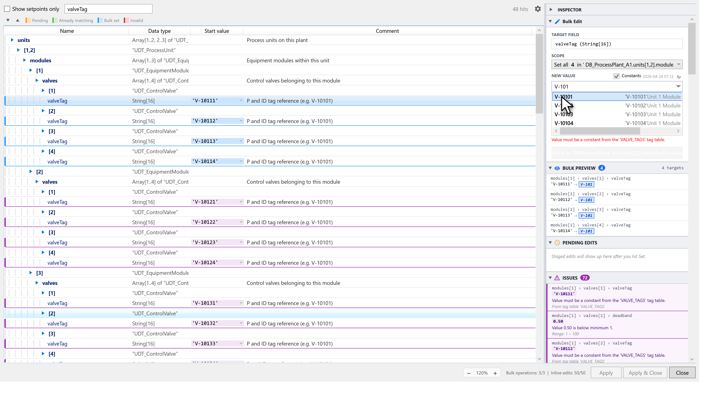

# Tag-Table Integration

Tag tables turn free-form value entry into a constrained pick list. Once a rule
references a tag table:

- The **NEW VALUE** field shows an autocomplete dropdown of matching constants.
- A **Constants** checkbox enables a full dropdown of valid entries.
- A `requireTagTableValue` constraint rejects anything that isn't in the table.
- Comment templates can pull the tag-table entry's name, value, or comment via
  [`{memberName.name}` / `{memberName.comment}`](comment-rules.md#tag-table-aware-placeholders).

## Where tag tables come from

BlockParam reads tag tables from a **local cache** that sits next to your TIA
exports:

```
%TEMP%\BlockParam\TagTables\*.xml
```

Each file is a TIA Portal tag-table XML export. There are two common ways the
cache gets populated:

1. **Right-click a tag table** in the TIA project tree → **Export** → save into
   `%TEMP%\BlockParam\TagTables\`. Repeat for every table you want
   BlockParam to know about. (TIA's export-to-XML is a per-table action.)
2. **Use the project context-menu integration** if available — see the version's
   release notes for which export entries are still in the menu.

> Why a manual export and not a live read? TIA Openness exposes tag tables, but
> reading them on every dialog open would tank context-menu latency. The cache
> trades a manual refresh for a sub-200 ms dialog open.

The dialog shows the cache age in the toolbar (e.g. *"Tag tables: 2 h old"*).
Click the **Refresh** icon to re-read after a fresh export.

## Wiring a rule to a tag table

In the [Rule Editor](rule-editor.md), set the **Tag Table** field to the tag-table
name (the file's table name, not the file path). Wildcards work:

| Tag Table value | Matches |
|---|---|
| `MOD_PUMPS` | Exactly the `MOD_PUMPS` table. |
| `MOD_*` | Every cached table whose name starts with `MOD_` (`MOD_PUMPS`, `MOD_VALVES`, …). |

Wildcards let you spread one rule across many tables — useful when each module
type has its own constants table but they share the same member name.

## Autocomplete in the editor

When you click into a member that has a tag-table rule and start typing in the
**NEW VALUE** field, the dropdown filters live:

<p align="center">
  
</p>

Each suggestion shows the constant name, value, and (where available) the
tag-table comment. Picking a suggestion writes the **value** to the cell — not the
constant name — which is what TIA stores internally for the start value.

## Required tag-table values

Tick **Require Value** in the rule editor (or set `requireTagTableValue: true`
in the JSON) to reject any value that doesn't appear in the referenced table.
This prevents typos and forces every value to come from a single source of truth.

The dialog shows a **red** invalid-value indicator on the row when validation
fails, and the Apply button stays disabled until the value is fixed.

## Constants dropdown for bulk edits

When the selected member has a tag-table rule, a **Constants** checkbox appears
above the NEW VALUE field in the Bulk Edit panel. Tick it and the field becomes
a dropdown of every valid constant — useful when you want to pick the same
constant for every target in scope without typing.

## Multi-language comments

The tag-table comment shown in the autocomplete dropdown and the
`{memberName.comment}` placeholder is read in the **active TIA Portal editing
language**. If the tag-table file has comments in multiple languages, BlockParam
picks the one matching the project's current editing language and falls back to
the reference language if the editing-language entry is missing.

## Common rule shapes

```json
// Force valveTag to a value from VALVE_TAGS
{
  "pathPattern": ".*\\.valveTag$",
  "tagTableReference": { "tableName": "VALVE_TAGS" },
  "constraints": { "requireTagTableValue": true }
}

// moduleId scoped to messageConfig_UDT, sourced from any MOD_* table
{
  "pathPattern": ".*{udt:messageConfig_UDT}\\.moduleId$",
  "datatype": "Int",
  "constraints": {
    "min": 0,
    "max": 9999,
    "requireTagTableValue": true
  },
  "tagTableReference": { "tableName": "MOD_*" }
}
```

## Troubleshooting

- **Autocomplete is empty** — confirm the table file exists in `%TEMP%\BlockParam\TagTables\`
  and click the toolbar **Refresh** to re-read the cache. The dialog log
  (`%APPDATA%\BlockParam\blockparam.log`) lists which tables loaded.
- **"Required value" rejects a value that's clearly in the table** — check the
  table's actual values vs. names. BlockParam matches by **value** first, then by
  **name**; if the table holds e.g. `1, 2, 3` as values and you typed `PUMP_01`,
  pick from the dropdown rather than typing the symbolic name.
- **Wildcard `MOD_*` matches nothing** — wildcards match table **names**, not
  filenames. Open one of the XML files and check the `Name` attribute on the
  `SW.Tags.PlcTagTable` element.

## Next

- [Comment rules](comment-rules.md) — using tag-table data inside comment templates.
- [Rule editor](rule-editor.md) — authoring rules visually.
- [Troubleshooting](troubleshooting.md) — broader recovery steps.
